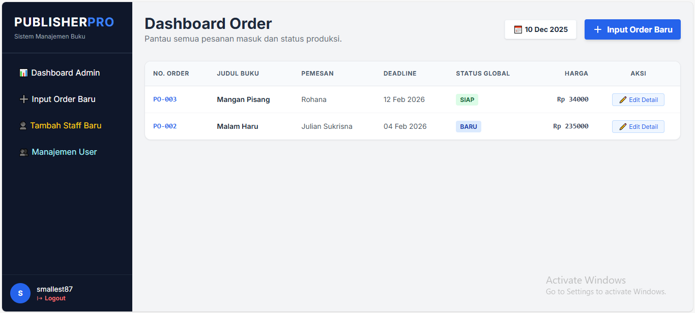

# PublisherPro - Sistem Manajemen Penerbitan Buku 📚


**PublisherPro** adalah aplikasi web terintegrasi berbasis Python/Django yang dirancang untuk mengelola alur kerja perusahaan penerbitan buku. Aplikasi ini menghubungkan Divisi Penerima Order, Studio Desain (Pre-Press), dan Lantai Produksi (Cetak/Finishing) dalam satu platform yang efisien dan aman.


*(Ganti link ini dengan screenshot aplikasi Anda nanti)*

## ✨ Fitur Utama

* **Multi-Role Access Control:**
    * **Admin/Penerima Order:** Input order, manajemen harga, pantau deadline, kelola user.
    * **Pre-Press (Desainer):** Update status layout/cover, upload file final (PDF/JPG).
    * **Produksi:** Operator cetak/binding hanya melihat spek teknis (tanpa harga), update progress real-time.
* **Workflow Automation:** Order otomatis memiliki status tracking (Layout -> Cetak -> Binding -> Finishing).
* **Secure File Management:** Upload dan unduh file naskah/cover aman antar divisi.
* **Privacy Protection:** Harga order disembunyikan dari divisi produksi (Privasi Dapur Perusahaan).
* **Modern UI:** Antarmuka responsif dan bersih menggunakan **Tailwind CSS**.
* **User Management:** Admin dapat menambah staff baru, menonaktifkan akun, dan mengatur divisi.

## 🛠️ Teknologi

* **Backend:** Python 3.10+, Django 5.0
* **Database:** SQLite (Dev), PostgreSQL (Recommended for Prod)
* **Frontend:** HTML5, Tailwind CSS (CDN)
* **Image Processing:** Pillow
* **Server:** Gunicorn, Nginx (untuk Production)

---

## 🚀 Instalasi Lokal (Development)

Ikuti langkah ini untuk menjalankan aplikasi di komputer Anda (Windows/Mac/Linux).

### 1. Clone Repository
```bash
git clone [https://github.com/username-anda/PublisherPro.git](https://github.com/username-anda/PublisherPro.git)
cd PublisherPro
````

### 2\. Buat Virtual Environment

Disarankan menggunakan virtual environment agar library tidak bentrok.

```bash
# Windows
python -m venv venv
venv\Scripts\activate

# Mac/Linux
python3 -m venv venv
source venv/bin/activate
```

### 3\. Install Dependencies

```bash
pip install -r requirements.txt
```

*Pastikan `requirements.txt` berisi: Django, Pillow, django-environ, gunicorn (opsional untuk dev).*

### 4\. Setup Database

```bash
python manage.py makemigrations
python manage.py migrate
```

### 5\. Buat Superuser (Admin)

```bash
python manage.py createsuperuser
# Ikuti instruksi input username, email, dan password
```

### 6\. Jalankan Server

```bash
python manage.py runserver
```

Akses aplikasi di: `http://127.0.0.1:8000/`

-----

## 🔐 Panduan Hak Akses (Role)

Sistem ini menggunakan **Django Groups**. Pastikan user dimasukkan ke grup yang benar agar dashboard muncul sesuai peran:

1.  **Group: `Penerima Order`** (atau Superuser)
      * Akses: Dashboard Admin, Input Order, Edit Detail, Lihat Harga.
2.  **Group: `Pre-Press`**
      * Akses: Studio Desain, Upload File Layout/Cover.
3.  **Group: `Produksi`**
      * Akses: Dashboard Merah (Produksi), Update Status Cetak/Jilid.

-----

## 🌐 Panduan Deployment (Production)

Panduan ini untuk deployment ke server Linux (Ubuntu/Debian) menggunakan **Gunicorn** dan **Nginx**.

### Persiapan di Server (Ubuntu)

1.  **Install Paket Sistem:**

    ```bash
    sudo apt update
    sudo apt install python3-pip python3-venv nginx
    ```

2.  **Siapkan Proyek di Server:**
    Lakukan langkah "Instalasi Lokal" (Clone, Venv, Install Req) di server Anda.

3.  **Kumpulkan File Statis:**
    Di server, jalankan perintah ini agar CSS/Gambar terkumpul:

    ```bash
    python manage.py collectstatic
    ```

### Konfigurasi Gunicorn (Application Server)

1.  **Test Gunicorn:**

    ```bash
    gunicorn --bind 0.0.0.0:8000 SistemPenerbitan.wsgi
    ```

    *Jika berjalan tanpa error, tekan Ctrl+C untuk berhenti.*

2.  **Buat Service Systemd:**
    `sudo nano /etc/systemd/system/publisherpro.service`

    Isikan (sesuaikan path):

    ```ini
    [Unit]
    Description=gunicorn daemon for PublisherPro
    After=network.target

    [Service]
    User=ubuntu
    Group=www-data
    WorkingDirectory=/home/ubuntu/PublisherPro
    ExecStart=/home/ubuntu/PublisherPro/venv/bin/gunicorn --access-logfile - --workers 3 --bind unix:/home/ubuntu/PublisherPro/publisherpro.sock SistemPenerbitan.wsgi:application

    [Install]
    WantedBy=multi-user.target
    ```

3.  **Jalankan Service:**

    ```bash
    sudo systemctl start publisherpro
    sudo systemctl enable publisherpro
    ```

### Konfigurasi Nginx (Web Server)

1.  **Buat Blok Server:**
    `sudo nano /etc/nginx/sites-available/publisherpro`

    Isikan:

    ```nginx
    server {
        listen 80;
        server_name domain-anda.com OR_IP_ADDRESS;

        location = /favicon.ico { access_log off; log_not_found off; }
        
        # Lokasi File Statis (CSS/JS)
        location /static/ {
            root /home/ubuntu/PublisherPro;
        }

        # Lokasi File Media (Upload User)
        location /media/ {
            root /home/ubuntu/PublisherPro;
        }

        location / {
            include proxy_params;
            proxy_pass http://unix:/home/ubuntu/PublisherPro/publisherpro.sock;
        }
    }
    ```

2.  **Aktifkan Nginx:**

    ```bash
    sudo ln -s /etc/nginx/sites-available/publisherpro /etc/nginx/sites-enabled
    sudo nginx -t
    sudo systemctl restart nginx
    ```

### 🛡️ Keamanan Tambahan

Di file `settings.py` pada server production, pastikan mengubah:

```python
DEBUG = False
ALLOWED_HOSTS = ['domain-anda.com', 'IP_SERVER_ANDA']
```

-----

## 🤝 Kontribusi

Pull request dipersilakan. Untuk perubahan besar, harap buka issue terlebih dahulu untuk mendiskusikan apa yang ingin Anda ubah.

## 📄 Lisensi

[MIT](https://choosealicense.com/licenses/mit/)